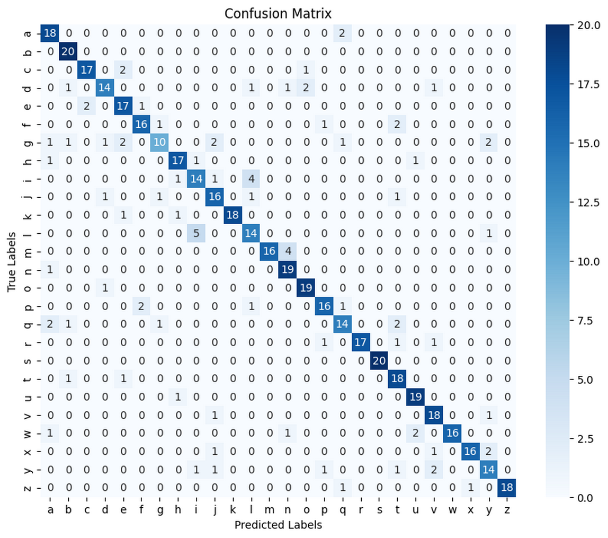
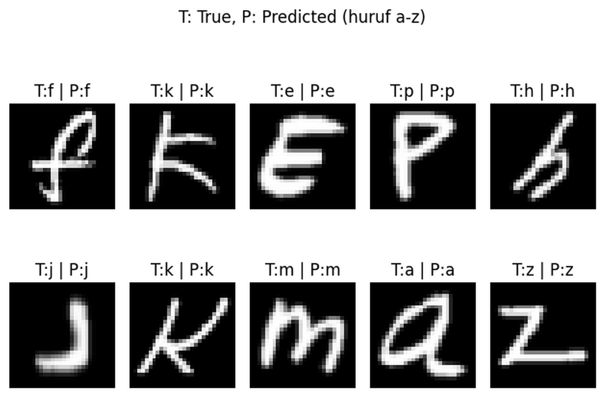

# **EMNIST-HOG-SVM-Classification**
This repository demonstrates a machine learning pipeline that uses HOG (Histogram of Oriented Gradients) for feature extraction and SVM (Support Vector Machine) for classification.

---

## 📚 Dataset

The dataset used in this project is from:  

👉 [EMNIST (Extended MNIST)](https://www.kaggle.com/datasets/crawford/emnist/data)

Specifically, it uses the **`emnist-letters`** subset, which contains grayscale images of handwritten English letters (A–Z).

For this demonstration, a total of **2,600 samples** are used — with **100 samples per class** across **26 classes**. The dataset is randomly split into **80% for training** and **20% for testing**.

---

## 🧩 Confusion Matrix
This confusion matrix shows the classification performance on the test set:

---

## 🧪 Classification Demo

Below is a demonstration of the model classifying 10 random samples from the test set:

---

